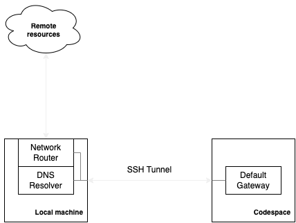

## How it works

Pic1. General diagram.

 

We bind to the `default gateway` network interface inside the codespace and forward all non-routed traffic to the `SSH tunnel` that connects a Codespace with your local machine. We forward only `L3` (`IP`) traffic and there are few criterias must hold for traffic to be forwarded:

- it must appear on the `default gateway`
- it must not be addressed tosomething that is on default gateway subnet

This ensures that we fallback to forwaring packets only if they were not handled by any other network interface inside a Codespace.

Once a packet reaches the local machine, we see if we can forward it to a meaningful destination, for that we resolve network interface that can handle the packet destination. Such network interface must not be a default gateway interface given that the packet destination is not to the gateway subnet, otherwise the packet is addressed to the internet which can be handled from within the codespace directly.

If such network interface is found, we create a local `network socket` and a `NAT` record for the connection. The NAT record is used to map the remote packet source address to the local network socket address, so it appears to the remote resource as if traffic is coming from the local machine. When a reply packet is received, we perform reverse address translation and send the packet back to the codespace (so it appears as if the reply came directly from the codespace default gateway interface).

For `DNS` packets, we register an address that is on the `default gateway` subnet which allows to catch all unresolved `DNS` queries. Once `DNS` packet is received, it is passed over to the `local machine` where the request to the local `DNS` resolver is made and a reply is sent back to the codespace.

The extension is written in `Rust` and provides high preformance, low memory footprint and memory safety, hence must cause low latency.
